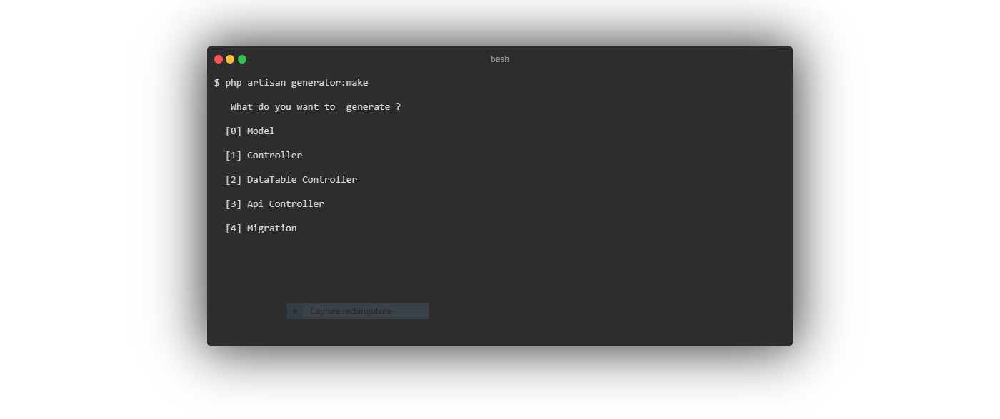

## Laravel Rapid Code Generation Package

### Demo Video

https://www.youtube.com/watch?v=oaAksK0UYvk

### Installation
`composer require chiheb/laravel-generator`

#### Provider

Add this provider to providers array in `config/app.php`

`Chiheb\Generator\LaravelGeneratorProvider::class`

### Usage
`php artisan generator:make`

### Available Generators

* Model
* Plain Controllers 
* DataTable Controllers : A controller that uses datatable package  
* Api Controllers : A controller have json response & Swagger UI Documented 
* Migrations